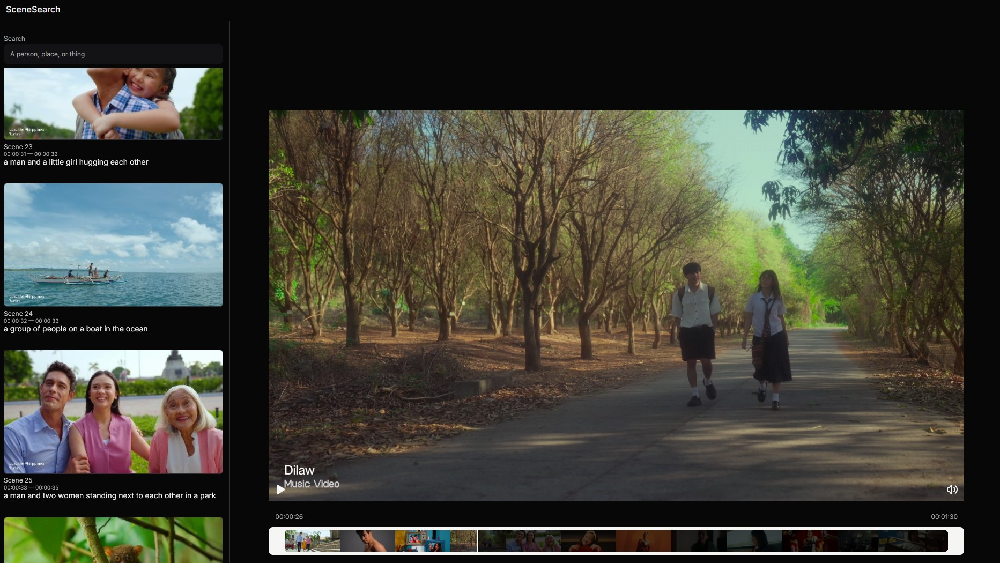

# Scene Search ML

Lightweight app for extracting video frames, generating captions & embeddings, and searching scenes by text.

## Key Features

- Client-side video upload / drag-and-drop with streaming frame extraction
- Scene detection and captioning
- Per-frame embeddings and text-based similarity search
- Real-time analysis via WebSocket (stream frames to backend for progressive processing)
- Fancy Video Progress UI

## Architecture

- `backend/` — FastAPI services:
	- REST endpoints: captioning, embedding, similarity
	- WebSocket analysis endpoints for streaming frame analysis
	- Services: captioner, embedder, scene detector, similarity
	- Model manager that selects and serves models (GPU-aware Dockerfiles provided)
- `frontend/` — Next.js app:
	- Video upload, thumbnail extraction, progressive UI
	- Search UI with results, frames, and scene view components
	- WebSocket client for analyze sessions

## Repository layout

- backend/
- frontend/
- docker-compose.yml (bring up full stack locally)

## Backend API (overview)

- REST endpoints (v1):
	- `POST /api/v1/caption` — caption a batch of frames
	- `POST /api/v1/embed` — generate embeddings for frames
	- `POST /api/v1/similar` — query similarity against stored embeddings
- WebSocket:
	- `/ws/analyze` — stream frames for incremental scene detection, captioning, and embedding. See `backend/app/api/v1/ws/analyze.py` and `analyze_session.py` for protocol details.

## Frontend features

- Video player with thumbnail progress, frame capture strategies, and controls (`frontend/src/features/video/components`)
- Search UI with results and scene view (`frontend/src/features/search/components`)
- WebSocket analyze client implementation in `frontend/src/features/video/utils/analyzeWebsocketClient.ts`

## Configuration & Limits

- Backend configuration lives in `backend/app/core/config.py`.
- Image limits and rate limiting can be found in `backend/app/core/image_limits.py` and `backend/app/core/rate_limiter.py`.

## Development notes & pointers

- Frame extraction is implemented client-side for speed and to avoid large uploads: `frontend/src/features/video/utils/extractFramesStream.ts`.
- Frame/thumbnail state is managed by `VideoFramesContext.tsx`.
- Services are organized under `backend/app/services/*` and are designed to be swapped with other model implementations.

## Contributing

Please open issues or PRs. For major changes, open an issue first to discuss the proposal.

## Contact

Project maintained by the author. Use the repo issue tracker for bugs and feature requests.

